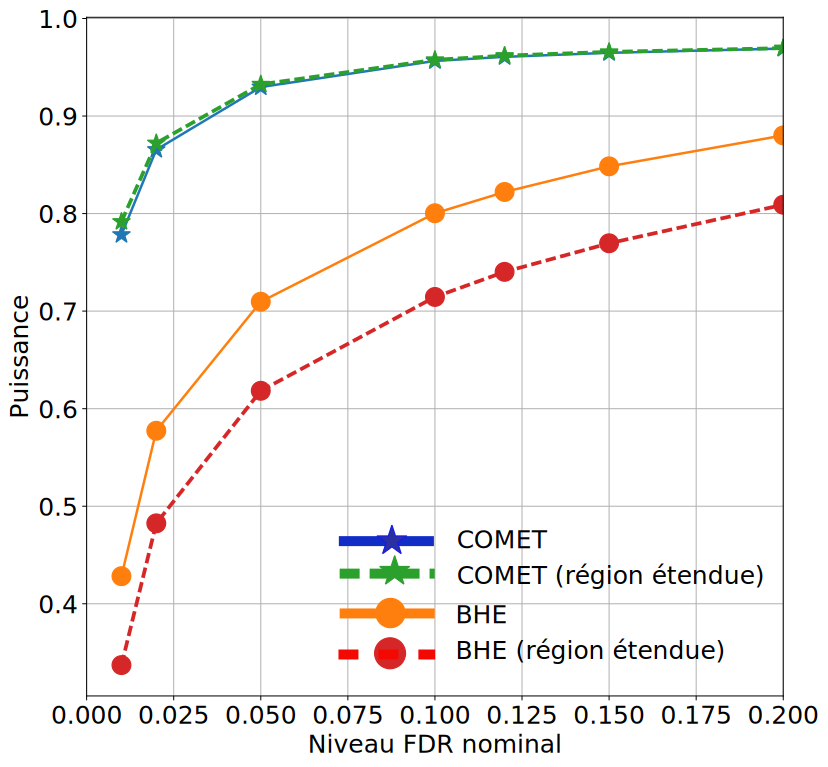

\renewcommand{\beps}{\boldsymbol{\epsilon}}
\renewcommand{\bd}{\boldsymbol{d}}
\renewcommand{\bx}{\boldsymbol{x}}
\renewcommand{\by}{\boldsymbol{y}}
\renewcommand{\bw}{\boldsymbol{w}}
\renewcommand{\bA}{\boldsymbol{A}}
\renewcommand{\bB}{\boldsymbol{B}}
\renewcommand{\bD}{\boldsymbol{D}}
\renewcommand{\bH}{\boldsymbol{H}}
\renewcommand{\bD}{\boldsymbol{D}}
\renewcommand{\bU}{\boldsymbol{U}}
\renewcommand{\bX}{\boldsymbol{X}}
\renewcommand{\bY}{\boldsymbol{Y}}
\renewcommand{\bZ}{\boldsymbol{Z}}
\renewcommand{\Ho}{\mathcal{H}_0}
\renewcommand{\var}{\textrm{var}}
\renewcommand{\argmin}{\textrm{argmin}}

# Introduction

## {#my_video data-background-video="./img/intro_soutenance_complet.mp4" data-background-color="#000" data-background-video-muted="true" style="opacity:0"}

## Limits of classical imagers for extragalactic structures
{.class width=90% }

## The MUSE Project

{.class width=80% }

 .jpg){.class width=80%}

* 3D Spectrograph
* European Consortium, piloted by CRAL à Lyon
* Observing since january 2014, already one of the most asked instrument of VLT

## Hyperspectral datacube

{.class width=100% }

<video controls>
   <source data-src="./img/animSpectralExplo.mp4" type="video/mp4" />
 </video>

<video controls>
   <source data-src="./img/animSpatialExplo.mp4" type="video/mp4" />
 </video>

Cube of dimensions $n_1 (\approx 300)\times n_2(\approx 300) \times \lambda (\approx 3600)$

## Redshift and detection

We want to detect hydrogen gas surrounding galaxies :

- Emission limited to a few wavelengths : Lyman-$\alpha$ emission line
- ... of unknown spectral position because of redshift

 
**Redshift** : during its trip to Earth, light emitted by a galaxy moving away from us (Universe expansion...) is shifted to the red (remember the ambulance !).

<!--<video controls class="center" style="width: 40%">
   <source data-src="./img/animRedshift.mp4" type="video/mp4" />
 </video>
-->

 

$\rightarrow$ Calls for detection methods adapted to these huge datasets.

## Outline
- Introduction
- Detection of extended sources
    - The Question
    - The Method
    - The Results
- Conclusion and perspectives

# Detection of extended sources

## CGM

We want to explore the gas halo surrounding a galaxy (Circum galactic medium or CGM).

 

Galaxy properties :

* Spatially limited (quasi-punctual)
* Lyman emission line + spectral continuum (+\ other lines)
* Known spatial and spectral (redshift) positions

Halo properties:

* Hydrogen gas
* Emission only in Lyman line
* Spatial extension around the galaxy
* Lyman emission similar (in first approx.) to the galaxy one

 
$\rightarrow$ need to explore a great number of pixels around the galaxy in search of the Lyman signature.

## Our detection problem
*Goal* : Detect a quasi-connected multipixel target, while ensuring global control of errors

On each pixel $i$, detection of a positive signal using a one-sided test :

$$
\left\{
\begin{array}{ll}
   \mathcal{H}_{0} : \by_i=\beps,\\
    \mathcal{H}_{1} : \by_i= \alpha_i \bd +\beps, \quad \textrm{ with } \alpha_i>0,
\end{array}
\right.
\label{eq:testingPb0}
$$

- $\beps \in \mathbb{R}^l$ : noise vector of unknown distribution but assumed **symmetrical** ;
- $\bd \in \mathbb{R}^l$ : known reference (Lyman signature) ;
- $\by_i \in \mathbb{R}^l$ : spectrum vector

## Multiple testing (1/2)
We have $n$ (~ 2500) pixels to test for :

- Which pixels have signal ? / Which pixels belong to the galactic halo ?

{.class width=30%}

How to have guaranties on the detection results, like the proportion of pixels among the detected set that are really part of the target ("purity of the detection") ?

## Multiple testing (2/2)

+:----------------------:+:----------------:+:-------------:+:----:+
|                        |  Detected $\Ho$  | Rejected $\Ho$|      |
+:----------------------:+:----------------:+:-------------:+:----:+
| True $\Ho$             |  $V$             | $U$           | $N_0$|
+:----------------------:+:----------------:+:-------------:+:----:+
| False $\Ho$            |  $S$             | $T$           | $N_1$|
+:----------------------:+:----------------:+:-------------:+:----:+
| *Total*                |  $N-R$           | $R$           | $N$  |
+:----------------------:+:----------------:+:-------------:+:----:+

 

PFA controls in average the $U/N_0$ ratio.

## PFA is not adapted to multiple testing

{.class width=100%}

- 100 $\mathcal{H}_1$ on 1000 tests
- PFA at 5% $\rightarrow$ 45 false positives in average
- power at 80% $\rightarrow$ 80 true positives

$\rightarrow$ 125 detections, 36% of which are false positives !

When the number of $\mathcal{H}_0$ is much larger than the number of $\mathcal{H}_1$, the poser/false alarm compromise is hard to establish.

$\rightarrow$ Need a control adapted to the number of tests.

## Need of a global error control : FDR

Global control : the *False Discovery Rate* (Benjamini & Hochberg 95)

+:----------------------:+:----------------:+:-------------:+:----:+
|                        |  Detected $\Ho$  | Rejected $\Ho$|      |
+:----------------------:+:----------------:+:-------------:+:----:+
| True $\Ho$             |  $V$             | $U$           | $N_0$|
+:----------------------:+:----------------:+:-------------:+:----:+
| False $\Ho$            |  $S$             | $T$           | $N_1$|
+:----------------------:+:----------------:+:-------------:+:----:+
| *Total*                |  $N-R$           | $R$           | $N$  |
+:----------------------:+:----------------:+:-------------:+:----:+

$$
\textrm{FDR} = \mathbb{E} \left[ \frac{U}{\max(R,1) } \right],
$$

- $R$: number of tests where null hypothesis is rejected ("discoveries")
- $U$: number of false discoveries among the $R$ discoveries.

## FDR control

<h3> BH procedure</h3>
Do $n$ tests that give $p$-values $p_{1} \ldots p_{n}$.
Note ordered $p$-values $p_{(1)} \leq p_{(k)}\leq p_{(n)}$ with convention p_{(0)}=0.

To get a FDR less or equal to $q$  when doing $n$ tests :

* Find the greatest $\widehat{k}$ such that $p_{(\widehat{k})} \leq \frac{\widehat{k}}{n} q$
* Reject null hypothesis for all $p_{(i)}$,  $i = 1, \ldots, \widehat{k}$

In case of independence (or under some special cases of dependencies) of the tests, the BH procedure ensures an exact control of FDR"

 

*By design, the power of the BH procedure decreases when the number of tests increases (with a fixed number of $\mathcal{H}_1$).*

## Application of BH procedure to our case

*Simple but generic approach* : test using a matched filter $\{w_i \equiv \bd^T\by_i\}_{1\leq i \leq  n}$

**Compute empirical $p$-values**

Key assumptions :

- noise distribution is symmetrical;
- source contribution is positive.

 

To have $\hat{F}_0$, the empirical distribution law of the $w_i$ under $\Ho$, it is sufficient to symmetrize the negative part of the empirical distribution of the data.

{width=50%}

$p$-value associated to the pixel $i$ : $p_i = 1-\hat{F}_0(w_i)$.

We can then apply the BH procedure to the empirical $p$-values
$\rightarrow$ *empirical* BH (EBH)

## Barber et Candes procedure (BC)
*BH procedure : the most well known but not always the most relevant*.

 
**A recent alternative  : the BC procedure (Barber & Candes 2015) :**

 

Build control statistics  $w_i$ that are

* symmetrical under $\mathcal{H}_0$, i.e. $\mathbb{P}(w_i>t | i \in \mathcal{H}_0)=\mathbb{P}(w_i<t | i \in \mathcal{H}_0)$,
* stochastically greater under $\mathcal{H}_1$, i.e. $\mathbb{P}(w_i>t | i \in \mathcal{H}_1)>\mathbb{P}(w_i>t | i \in \mathcal{H}_0)$.

 
We then sort $w_i$ by absolute decreasing order :
$|w_{(1)}|\geq |w_{(i)}|\geq |w_{(n)}|$.

 
Then we control at level $q$ by keeping $|w_{(1)}|,\ldots ,|w_{(\widehat{k})}|$ where:
$$\widehat{k}= \max \left\{ k : \frac{1+\#\{w_{(i),i\leq k}<0\}}{\#\{w_{(i),i\leq k}>0\}}\right\}$$

## Control statistics

**Issue** : in (BC 2015) construction of the control statistics using knockoffs
$\rightarrow$ low power and high computational cost in high dimension.

 

Here we already have the following hypothesis :

- noise distribution is symmetrical.
- sources have a positive contribution

$\rightarrow$ Easy build of the control statistics $\{w_i \equiv \bd^T\by_i\}_{1\leq i \leq  n}$.

Estimate of the False Discovery Proportion FDP (among the $w_i>0$ discovered in a set $\mathcal{A}$) :
$$
 \widehat{q}= \frac{1+\#\{i\in \mathcal{A}, w_i<0\}}{1 \vee \#\{i\in \mathcal{A}, w_i>0\}}.
 \label{eq:qestim2}
$$

 

With these control statistics,   and BC procedures can be shown to be equivalents. How can we now gain in power ?

## COMET idea
The BC procedure sort statistics by absolute value before looking at the signs.
BUT ... we can sort the statistics in another way, for ex. here to promote connectivity.

<h3>Algorithm </h3>

*Region growth :*

- start from an already detected region (galactic core)
    - add to the area the new pixels of interest from the neighborhood (cf next slide)
    - estimate the $\widehat{FDP}$ on the pixels of this area
    - iterate onto the new neighborhood of the extended area
- stop onto the largest set of selection with $\widehat{FDP}$ inferior to the given FDR
- in this set of exploration \mathcal{A} we only keep as detection pixels $i$ with $w_i\geq 0$

## Selection procedure

To control FDR, the selection procedure must follow [P1] :

**Post-selection symmetry [P1]**:

For any *selected* pixel $j$  corresponding to a true null hypothesis, the control statistic $w_j$ is symmetrically distributed.

 

$\rightarrow$ Greedy approach proposed :

 At each step, the greatest statistic (in absolute value) among the neighbors is selected.

<!--
## COMET in action

**Generic COMET step-up procedure**

- *Input* : stats $\bw=\{w_j\}_{1\le j\le n}$, nominal control $q$
- Initialization : $k\leftarrow 0$, $\mathcal{A}_0 \leftarrow \emptyset$, $\widehat{q}_{0} \leftarrow 0$
- While $\mathcal{A}_{k}\neq \{1,\ldots,n\}$:
    - $\mathcal{A}_{k+1} \leftarrow S( \mathcal{A}_{k}, \bw )$ (Selection verifying P1)
    - Compute  $\widehat{q}_{k+1}$ par \eqref{eq:qestim2} (Update $\widehat{FDP}$)
    - $k\leftarrow k+1$

- $\widehat{k} \leftarrow \max\{k: \widehat{q}_k\leq q\}$ (Sopping criterion)
- *Ouput :*
$\mathcal{D} \leftarrow \{i\in \mathcal{A}_{\widehat{k}} : w_i>0\}$ (list of detections)

- $\mathcal{A}_k$ : selected pixels at step $k$ ;
- $S$ selection procedure
-->

## COMET in action

<video controls>
   <source data-src="./img/animCOMET_v2.mp4" type="video/mp4" />
 </video>

## To summarize  : PFA

PFA control : thresholding of $p$-values

{width=70%}

{width=70%}

## To summarize : EBH

FDR control using EBH : thresholding of $p$-values pondered by the number of tests

{width=70%}

{width=70%}

## To summarize : BC

FDR control using BC : sort statistics control by absolute value

{width=100%}

{width=100%}

{width=100%}

## To summarize : COMET

FDR control by COMET : sort statistics control using region growth

{width=100%}

{width=100%}

{width=100%}

## COMET properties

<h3> Exact control of FDR if independence of the noise</h3>
Let the noise vectors $\beps_1,\ldots,\beps_n$ be symmetrically distributed and independent.
Then the COMET procedure ensures an exact control of FDR :
$$\mathbb{E} \left[ \frac{U}{R\vee1} \right] \leq q$$

<h3> Asymptotic control if correlated noise</h3>
Under the assumption of weakly dependent noise, if the control statistics are symmetrically distributed under $\mathcal{H}_0$, COMET ensures an asymptotic control of FDR.

 
*Rk 1 : MUSE data follow this second case (short-range correlations).*

*Rk 2: Note that these results do not require any stationarity of the noise.*

## Results (simulation)

{.class width=60%}

{.class width=60%}

* Same error control
* Increase in detection power
* Power independent of total number of tests (i.e. size of explored region)

## Application to real data
- Preprocessing :
    - continuum subtraction
    - SNR enhancement

- Spectral variability : detection over a dictionary of spectral signatures
    * $\bd_0$ : spatial mean of galaxy core spectra.
    * $\bD$ : dictionary of shifts of $\bd_0$.
    * Control statistics : max over all atoms of the Spectral Angular Distance (SAD) .
    $$SAD(\bd_{0},\bx) = \frac{\bd_{0}.\bx}{||\bd_{0}|| ||\bx||}$$

## {#result_detect}

Demo time !

# Conclusion and perspectives

## Conclusion

- Empirical approaches : no need to specify the law under $H_0$ (~ non parametric learning)
- Robust control of errors using this learning
- Simple hypotheses : noise symmetry and positivity of the source
- Take into account a spatial connectivity prior
- Generic detection method under FDR control with constraints
- Meaningful notion of "connected FDR" ("purity" of the detection)

## Perspectives

- Add new priors in COMET (spectral continuity using evolution models...)
- COMET can be applied to other fields (fMRI ...)
- New data with new properties (adaptive optics)

## On the shoulders of giants...

<h3> References </h3>
- Benjamin & Hochberg, *Controlling the False Discovery Rate: A Practical and Powerful Approach to Multiple Testing*, 1995
- Barber & Candes, *Controlling the false discovery rate via knockoffs*, 2015
- ...

<h3> Open software</h3>
- Python
- Scipy
- Bokeh
- RevealJS
- Jupyter

{.class width=30%}

Présentation : <https://phd.rbacher.fr/soutenance/slides/>

Animations : <https://phd.rbacher.fr/>

## Thank you !
